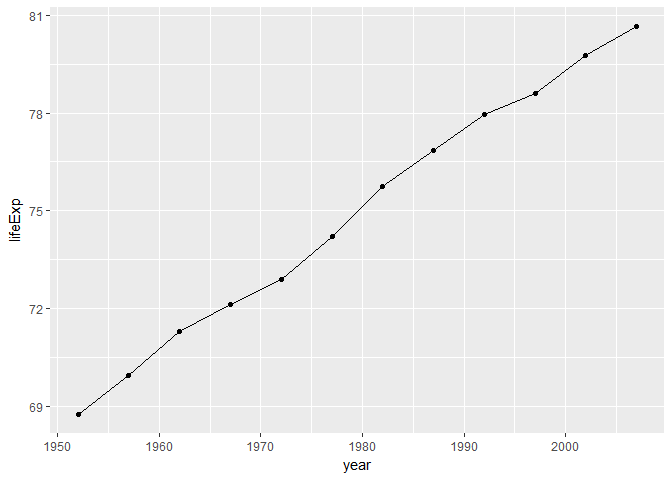

Exploration into Gapminder
================
Nicole Hawe
September 25, 2017

Introduction
------------

Within this second homework assignment, we explore the Gapminder dataset in more detail.

This page will cover the work flow for:

-   Overall Properties of the Gapminder Dataset

-   Variable Property Exploration

-   Data Visualization using ggplot2

-   Data Filtering/ Piping

-   Reflections

Overall Properties of the Dataset
---------------------------------

The first step is to load the Gapminder dataset and packages we need!

``` r
library(gapminder)
library(tidyverse)
```

    ## Loading tidyverse: ggplot2
    ## Loading tidyverse: tibble
    ## Loading tidyverse: tidyr
    ## Loading tidyverse: readr
    ## Loading tidyverse: purrr
    ## Loading tidyverse: dplyr

    ## Conflicts with tidy packages ----------------------------------------------

    ## filter(): dplyr, stats
    ## lag():    dplyr, stats

``` r
library(dplyr)
```

``` r
library(ggplot2)
```

So the assignment begins with the question: what is Gapminder? Is it a data.frame, a matrix, a vector, a list? Well, I decided to check this by using typeof() function.

``` r
typeof(gapminder)
```

    ## [1] "list"

However I would like to know the class of gapminder

``` r
class(gapminder)
```

    ## [1] "tbl_df"     "tbl"        "data.frame"

It appears to be a data frame, or more specifically a tibble!

Next, information regarding the struture of the dataset was asked such as:

-   How many variables/columns do we have? We can use ncol in R

-   How many rows/observations do we have? We can use nrow in R

``` r
ncol(gapminder)
```

    ## [1] 6

``` r
nrow(gapminder)
```

    ## [1] 1704

So it looks like this dataset has 6 columns with 1704 rows!

The it was asked whether we can get these facts about “extent” or “size” in more than one way? Can you imagine different functions being useful in different contexts?

we can find the length by

``` r
length(gapminder)
```

    ## [1] 6

Or the dimensions by

``` r
dim(gapminder)
```

    ## [1] 1704    6

We can also find the names of all th columns by

``` r
names(gapminder)
```

    ## [1] "country"   "continent" "year"      "lifeExp"   "pop"       "gdpPercap"

Or get an overall sense of the structure using

``` r
str(gapminder)
```

    ## Classes 'tbl_df', 'tbl' and 'data.frame':    1704 obs. of  6 variables:
    ##  $ country  : Factor w/ 142 levels "Afghanistan",..: 1 1 1 1 1 1 1 1 1 1 ...
    ##  $ continent: Factor w/ 5 levels "Africa","Americas",..: 3 3 3 3 3 3 3 3 3 3 ...
    ##  $ year     : int  1952 1957 1962 1967 1972 1977 1982 1987 1992 1997 ...
    ##  $ lifeExp  : num  28.8 30.3 32 34 36.1 ...
    ##  $ pop      : int  8425333 9240934 10267083 11537966 13079460 14880372 12881816 13867957 16317921 22227415 ...
    ##  $ gdpPercap: num  779 821 853 836 740 ...

The str function is a way of viewing the number of columns and rows along with the class and name of each variable! This is a great way to see many overall facts about the dataset!

``` r
summary(gapminder)
```

    ##         country        continent        year         lifeExp     
    ##  Afghanistan:  12   Africa  :624   Min.   :1952   Min.   :23.60  
    ##  Albania    :  12   Americas:300   1st Qu.:1966   1st Qu.:48.20  
    ##  Algeria    :  12   Asia    :396   Median :1980   Median :60.71  
    ##  Angola     :  12   Europe  :360   Mean   :1980   Mean   :59.47  
    ##  Argentina  :  12   Oceania : 24   3rd Qu.:1993   3rd Qu.:70.85  
    ##  Australia  :  12                  Max.   :2007   Max.   :82.60  
    ##  (Other)    :1632                                                
    ##       pop              gdpPercap       
    ##  Min.   :6.001e+04   Min.   :   241.2  
    ##  1st Qu.:2.794e+06   1st Qu.:  1202.1  
    ##  Median :7.024e+06   Median :  3531.8  
    ##  Mean   :2.960e+07   Mean   :  7215.3  
    ##  3rd Qu.:1.959e+07   3rd Qu.:  9325.5  
    ##  Max.   :1.319e+09   Max.   :113523.1  
    ## 

The summary function shows the dataset in a different way and for variables that are numbers or integers it shows importants statistics on them!

As you can see this information can be found in several ways!

Next we needed to find the type of each variable in this dataset using the typeof function

``` r
typeof(gapminder$country)
```

    ## [1] "integer"

``` r
typeof(gapminder$continent)
```

    ## [1] "integer"

``` r
typeof(gapminder$year)
```

    ## [1] "integer"

``` r
typeof(gapminder$lifeExp)
```

    ## [1] "double"

``` r
typeof(gapminder$pop)
```

    ## [1] "integer"

``` r
typeof(gapminder$gdpPercap)
```

    ## [1] "double"

Exploration of Individual Variables
-----------------------------------

For this part of the homework assignment we were to pick at least one categorical variable and at least one quantitative variable to explore.

For my categorical variable I chose **Year**

For my quantitative variable I chose **LifeExp**

For these we needed to find the possible values (or range, whichever is appropriate) of each variable?

What values are typical? What’s the spread? What’s the distribution?

So beginning with Year:

I wanted a nice summary to start with

``` r
summary(gapminder$year)
```

    ##    Min. 1st Qu.  Median    Mean 3rd Qu.    Max. 
    ##    1952    1966    1980    1980    1993    2007

``` r
table(gapminder$year)
```

    ## 
    ## 1952 1957 1962 1967 1972 1977 1982 1987 1992 1997 2002 2007 
    ##  142  142  142  142  142  142  142  142  142  142  142  142

From this quick summary and table I see that the minimum year is 1952 and it ranges to the maximum being 2007. Both the median and mean are 1980. I also appears that samples were taken every 5 years starting in 1952.

Moving onto the quantitative variable LifeExp:

``` r
summary(gapminder$lifeExp)
```

    ##    Min. 1st Qu.  Median    Mean 3rd Qu.    Max. 
    ##   23.60   48.20   60.71   59.47   70.85   82.60

From this summary we can see the minimum value is 23.60 whereas the max is 82.60. This is quite a large spread. The median lies at 60.71 and the mean at 59.47.

For a value such as LifeExp a table may be too large and unuseful.

A quick plot can sometimes help though!

``` r
hist(gapminder$lifeExp)
```


Gapminder Dataset Visualization Using ggplot2
---------------------------------------------

In this part of the assignment we were to make a few plots, using the same variable we chose to characterize numerically. The goal was to try to explore more than one plot type. For example:

-   A scatterplot of two quantitative variables.

-   A plot of one quantitative variable. Maybe a histogram or densityplot or frequency polygon.

-   A plot of one quantitative variable and one categorical. Maybe boxplots for several continents or countries.

For a scatterplot I chose to see the relationship between LifeExp and gdpPerCap

``` r
ggplot(gapminder, aes(x = gdpPercap, y = lifeExp)) + geom_point()
```


Next I wanted to check out a histogram for gdpPercap

``` r
hist(gapminder$gdpPercap)
```


ALso just to refresh your memory a histogram of LifeExp

``` r
hist(gapminder$lifeExp)
```


Now I wanted to test out a plot while changing the colour:

``` r
ggplot(gapminder, aes(x=year, y=lifeExp)) +
  geom_point(size=2, aes(colour = continent))
```


Next I wanted to try something a little more interesting. I wanted to look at LifeExp versus Year, but I wanted to divide this into countries. I arbitrarily picked Canda, Afghanistan, Sweden, Rwanda, and Spain. Let's see if we can pull this off.

Please note I used [This helpful link](https://github.com/jennybc/ggplot2-tutorial)

``` r
jCountries <- c("Canada", "Afghanistan", "Sweden", "Rwanda", "Spain")
ggplot(subset(gapminder, country %in% jCountries), aes(x = year, y = lifeExp, color = country)) + geom_line() + geom_point()
```


You can really see the large separation between more developed countries (Sweden, Canada, and Spain) and lesser like Rwanada and afghanistan. Also you see a severe dip in LifeExp in Rwanada around 1992, I'm guessing due to the war happening around that time.

Piping Practice with Dyplyr Function
------------------------------------

Next we went on to practice the filter function as well as piping the dyplyr filter and select functions together! These functions help narrow down and focus in on the data we care about. Say I only wanted the LifeExp versus year for Canada I could filter this:

``` r
ggplot(gapminder %>% filter(country == "Canada"), aes(x = year, y = lifeExp)) + geom_line() + geom_point()
```


Next I wanted to attempt to use filter and select together to plot LifeExp versus Year for Cambodia:

``` r
filter(gapminder, country == c("Cambodia")) %>%select(year, lifeExp) %>%ggplot(aes(x=year, y=lifeExp))+ geom_line() + geom_point()
```



Again you see a drastic drop in LifeExp around 1975, again around the time this country was experiencing a civil war.
