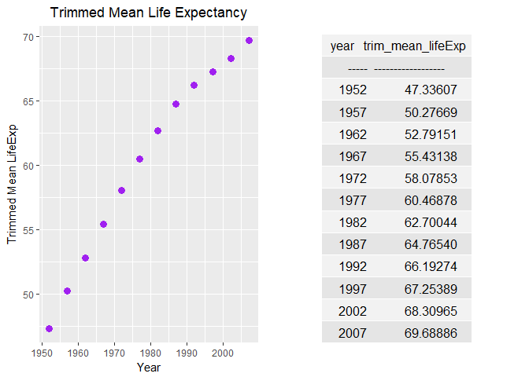

But I Want To Do More
================
Nicole Hawe
October 3, 2017

``` r
library(gapminder)
library(tidyverse)
```

    ## Loading tidyverse: ggplot2
    ## Loading tidyverse: tibble
    ## Loading tidyverse: tidyr
    ## Loading tidyverse: readr
    ## Loading tidyverse: purrr
    ## Loading tidyverse: dplyr

    ## Conflicts with tidy packages ----------------------------------------------

    ## filter(): dplyr, stats
    ## lag():    dplyr, stats

``` r
library(knitr)
library(kableExtra)
```

    ## Warning: package 'kableExtra' was built under R version 3.4.2

``` r
library(gridExtra)
```

    ## Warning: package 'gridExtra' was built under R version 3.4.2

    ## 
    ## Attaching package: 'gridExtra'

    ## The following object is masked from 'package:dplyr':
    ## 
    ##     combine

``` r
# loaded grid extra to help put table and figure side by side
```

#### Layout Stretch Goal

Okay so I had trouble using the code found [here](http://gist.github.com/jennybc/e9e9aba6ba18c72cec26) So I found another way using the package [gridExtra](https://cran.r-project.org/web/packages/gridExtra/gridExtra.pdf)

So remember from Task 3 we had:

``` r
n5 <- gapminder %>% 
  group_by(year) %>% 
  summarise(trim_mean_lifeExp = mean(lifeExp, trim=0.25)) %>% 
  arrange(year) %>% 
  select(year, trim_mean_lifeExp)

t1 <- kable(n5)
t1
```

|     year|   trim\_mean\_lifeExp|
|--------:|---------------------:|
|     1952|              47.33607|
|     1957|              50.27669|
|     1962|              52.79151|
|     1967|              55.43138|
|     1972|              58.07853|
|     1977|              60.46878|
|     1982|              62.70044|
|     1987|              64.76540|
|     1992|              66.19274|
|     1997|              67.25389|
|     2002|              68.30965|
|     2007|              69.68886|
|  Also th|  e accompanying plot:|

``` r
p2 <- ggplot(n5, aes(x=year, y=trim_mean_lifeExp)) +
  geom_point(colour="purple", size=3) +
  labs(x="Year", y="Trimmed Mean LifeExp")+
  ggtitle("Trimmed Mean Life Expectancy") +
  theme(plot.title = element_text(hjust=0.5))
p2
```


Now in order to get them side by side we need to define a tableGrob for gridExtra:

``` r
t1a <- tableGrob(t1)
grid.arrange(p2, t1a, nrow=1)
```



This does not look fantastic but is better than nothing. I'm looking forward to hearing other suggestions!

#### Table Stretch Goals

I decided to venture into pander to make a different style of table:

``` r
library(pander)
```

    ## Warning: package 'pander' was built under R version 3.4.2

``` r
pander(n5)
```

<table style="width:36%;">
<colgroup>
<col width="9%" />
<col width="26%" />
</colgroup>
<thead>
<tr class="header">
<th align="center">year</th>
<th align="center">trim_mean_lifeExp</th>
</tr>
</thead>
<tbody>
<tr class="odd">
<td align="center">1952</td>
<td align="center">47.34</td>
</tr>
<tr class="even">
<td align="center">1957</td>
<td align="center">50.28</td>
</tr>
<tr class="odd">
<td align="center">1962</td>
<td align="center">52.79</td>
</tr>
<tr class="even">
<td align="center">1967</td>
<td align="center">55.43</td>
</tr>
<tr class="odd">
<td align="center">1972</td>
<td align="center">58.08</td>
</tr>
<tr class="even">
<td align="center">1977</td>
<td align="center">60.47</td>
</tr>
<tr class="odd">
<td align="center">1982</td>
<td align="center">62.7</td>
</tr>
<tr class="even">
<td align="center">1987</td>
<td align="center">64.77</td>
</tr>
<tr class="odd">
<td align="center">1992</td>
<td align="center">66.19</td>
</tr>
<tr class="even">
<td align="center">1997</td>
<td align="center">67.25</td>
</tr>
<tr class="odd">
<td align="center">2002</td>
<td align="center">68.31</td>
</tr>
<tr class="even">
<td align="center">2007</td>
<td align="center">69.69</td>
</tr>
</tbody>
</table>

There this gives another table making option, however I didn't go too crazy with customization, I'll leave that for the future.

I chose pander with the help found [here](https://twitter.com/polesasunder/status/464132152347475968)

Back to My [HW3 Folder](https://github.com/nicolehawe/STAT545-HW-Hawe-Nicole/tree/master/HW03)
