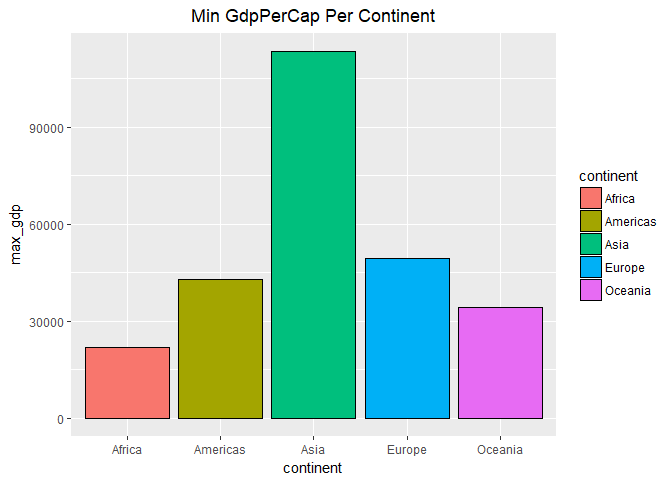
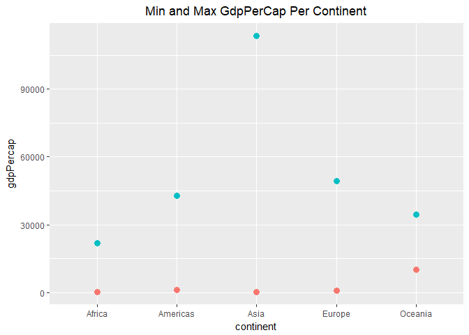

Task 1
================
Nicole Hawe
October 2, 2017

``` r
library(gapminder)
library(tidyverse)
```

    ## Loading tidyverse: ggplot2
    ## Loading tidyverse: tibble
    ## Loading tidyverse: tidyr
    ## Loading tidyverse: readr
    ## Loading tidyverse: purrr
    ## Loading tidyverse: dplyr

    ## Conflicts with tidy packages ----------------------------------------------

    ## filter(): dplyr, stats
    ## lag():    dplyr, stats

``` r
library(knitr)
library(dplyr)
library(reshape2)
```

    ## 
    ## Attaching package: 'reshape2'

    ## The following object is masked from 'package:tidyr':
    ## 
    ##     smiths

``` r
library(grid)
```

------------------------------------------------------------------------

Task 1
======

------------------------------------------------------------------------

#### Find the Maximum and Minimum GDP per Capita for all Continents

``` r
n1 <- gapminder %>%
  group_by(continent) %>%
  summarize(max_gdp = max(gdpPercap), min_gdp = min(gdpPercap))
n1
```

    ## # A tibble: 5 x 3
    ##   continent   max_gdp    min_gdp
    ##      <fctr>     <dbl>      <dbl>
    ## 1    Africa  21951.21   241.1659
    ## 2  Americas  42951.65  1201.6372
    ## 3      Asia 113523.13   331.0000
    ## 4    Europe  49357.19   973.5332
    ## 5   Oceania  34435.37 10039.5956

Here I simply got a summarize output for a table but I wanted to explore table options using knitr:

Using the code found [here](http://stat545.com/hw03_dplyr-and-more-ggplot2.html)

``` r
knitr::kable(n1)
```

| continent |   max\_gdp|    min\_gdp|
|:----------|----------:|-----------:|
| Africa    |   21951.21|    241.1659|
| Americas  |   42951.65|   1201.6372|
| Asia      |  113523.13|    331.0000|
| Europe    |   49357.19|    973.5332|
| Oceania   |   34435.37|  10039.5956|

Next I wanted some visual representation of these stats:

``` r
ggplot(n1,aes(x=continent,y=max_gdp)) + geom_bar(stat="identity")
```



``` r
ggplot(n1,aes(x=continent,y=min_gdp)) + geom_bar(stat="identity")
```


