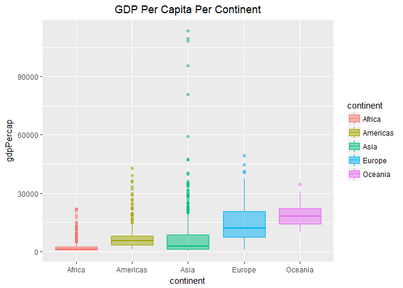

Task 2
================
Nicole Hawe
October 2, 2017

``` r
library(gapminder)
library(tidyverse)
```

    ## Loading tidyverse: ggplot2
    ## Loading tidyverse: tibble
    ## Loading tidyverse: tidyr
    ## Loading tidyverse: readr
    ## Loading tidyverse: purrr
    ## Loading tidyverse: dplyr

    ## Conflicts with tidy packages ----------------------------------------------

    ## filter(): dplyr, stats
    ## lag():    dplyr, stats

``` r
library(knitr)
library(kableExtra)
```

    ## Warning: package 'kableExtra' was built under R version 3.4.2

#### Look at the Spread of GDP per Capita Within the Continents

I was a little bit unclear on what was wanted with this question so to begin I used all of the data to plot the complete spread of GdpPerCap for all the continents:

``` r
gapminder %>%
  group_by(continent) %>%
  ggplot(aes(gdpPercap, fill=continent)) + 
  geom_histogram(color="black") +
  facet_wrap(~continent, scales="free")
```

    ## `stat_bin()` using `bins = 30`. Pick better value with `binwidth`.


Then I created a table however due to the size of a table for this sort of data I decided to only show part of it using the "head" function:

``` r
t3 <- gapminder %>%
  group_by(continent) %>%
  select(continent,gdpPercap)

t4 <- head(t3)
kable(t4)
```

| continent |  gdpPercap|
|:----------|----------:|
| Asia      |   779.4453|
| Asia      |   820.8530|
| Asia      |   853.1007|
| Asia      |   836.1971|
| Asia      |   739.9811|
| Asia      |   786.1134|

I could also interpret the spread to mean the mean GdpPerCap with the standard deviation for each continent so I did that as well:

``` r
n4 <- gapminder %>% 
  group_by(continent) %>% 
  summarize(mean_gdp=mean(gdpPercap),sd_gdp=sd(gdpPercap))
kable(n4,format='markdown')
```

| continent |  mean\_gdp|    sd\_gdp|
|:----------|----------:|----------:|
| Africa    |   2193.755|   2827.930|
| Americas  |   7136.110|   6396.764|
| Asia      |   7902.150|  14045.373|
| Europe    |  14469.476|   9355.213|
| Oceania   |  18621.609|   6358.983|

This data can then be visulaized with a box plot:

``` r
gapminder %>%
  ggplot(aes(x=continent, y=gdpPercap)) + 
  geom_boxplot(aes(group=continent, colour=continent, fill=continent),alpha=0.5)+
  ggtitle("GDP Per Capita Per Continent")+
  theme(plot.title = element_text(hjust = 0.5))
```


