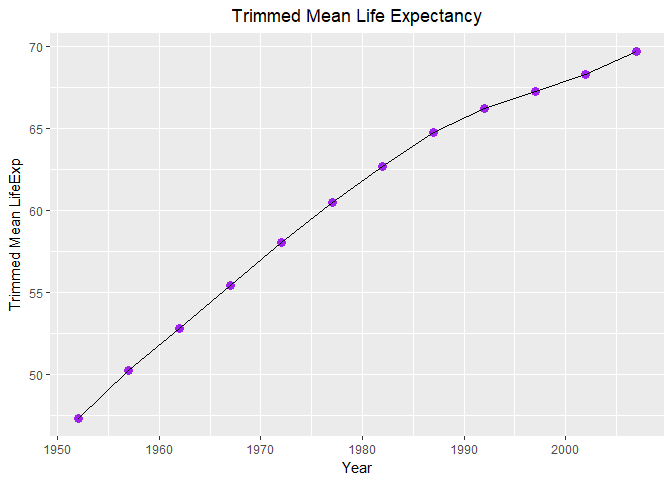

Task 3
================
Nicole Hawe
October 3, 2017

``` r
library(gapminder)
library(tidyverse)
```

    ## Loading tidyverse: ggplot2
    ## Loading tidyverse: tibble
    ## Loading tidyverse: tidyr
    ## Loading tidyverse: readr
    ## Loading tidyverse: purrr
    ## Loading tidyverse: dplyr

    ## Conflicts with tidy packages ----------------------------------------------

    ## filter(): dplyr, stats
    ## lag():    dplyr, stats

``` r
library(knitr)
library(kableExtra)
```

    ## Warning: package 'kableExtra' was built under R version 3.4.2

#### Compute a trimmed mean of life expectancy for different years. Or a weighted mean, weighting by population. Just try something other than the plain vanilla mean.

For this question I decided to tackle *trimmed mean*:

``` r
n5 <- gapminder %>% 
  group_by(year) %>% 
  summarise(trim_mean_lifeExp = mean(lifeExp, trim=0.25)) %>% 
  arrange(year) %>% 
  select(year, trim_mean_lifeExp)

# I grouped by year, and then used summarize not mutate in order to collaspe the years into one row not add columns with the trimmed mean but having multiple years

kable(n5)
```

|  year|  trim\_mean\_lifeExp|
|-----:|--------------------:|
|  1952|             47.33607|
|  1957|             50.27669|
|  1962|             52.79151|
|  1967|             55.43138|
|  1972|             58.07853|
|  1977|             60.46878|
|  1982|             62.70044|
|  1987|             64.76540|
|  1992|             66.19274|
|  1997|             67.25389|
|  2002|             68.30965|
|  2007|             69.68886|

Then I went on to visualize this trimmed mean life expectancy using a line graph:

``` r
ggplot(n5, aes(x=year, y=trim_mean_lifeExp)) +
  geom_point(colour="purple", size=3) +
  labs(x="Year", y="Trimmed Mean LifeExp")+
  ggtitle("Trimmed Mean Life Expectancy") +
  theme(plot.title = element_text(hjust=0.5))
```


