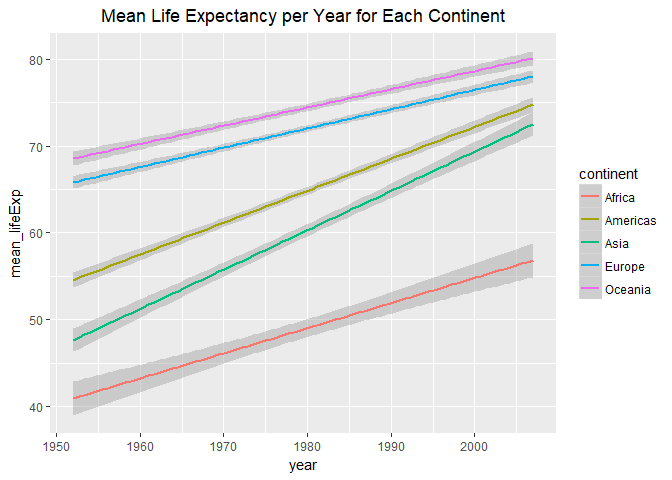

Task 4
================
Nicole Hawe
October 3, 2017

``` r
library(gapminder)
library(tidyverse)
```

    ## Loading tidyverse: ggplot2
    ## Loading tidyverse: tibble
    ## Loading tidyverse: tidyr
    ## Loading tidyverse: readr
    ## Loading tidyverse: purrr
    ## Loading tidyverse: dplyr

    ## Conflicts with tidy packages ----------------------------------------------

    ## filter(): dplyr, stats
    ## lag():    dplyr, stats

``` r
library(knitr)
library(kableExtra)
```

    ## Warning: package 'kableExtra' was built under R version 3.4.2

#### How is life expectancy changing over time on different continents?

For this question I decided to group by continent and year, and then compute the mean for life expectancy over the different continents every year data was taken.

``` r
n6 <- gapminder %>% 
  group_by(continent, year) %>% 
  summarize(mean_lifeExp = mean(lifeExp)) %>% 
  select(continent, year, mean_lifeExp) %>% 
  arrange(year) 

kable(head(n6),format='markdown')
```

| continent |  year|  mean\_lifeExp|
|:----------|-----:|--------------:|
| Africa    |  1952|       39.13550|
| Americas  |  1952|       53.27984|
| Asia      |  1952|       46.31439|
| Europe    |  1952|       64.40850|
| Oceania   |  1952|       69.25500|
| Africa    |  1957|       41.26635|

``` r
# I used head here to give a glimpse of the quite large table produced
```

I then plotted using a line graph with a linear regression:

``` r
n6 %>% 
   ggplot(aes(year,mean_lifeExp,color=continent)) +
  geom_smooth(method="lm")+
  ggtitle("Mean Life Expectancy per Year for Each Continent")+
  theme(plot.title = element_text(hjust = 0.5))
```



Move on to [Task 5](https://github.com/nicolehawe/STAT545-HW-Hawe-Nicole/blob/master/HW03/Task_5.md)
