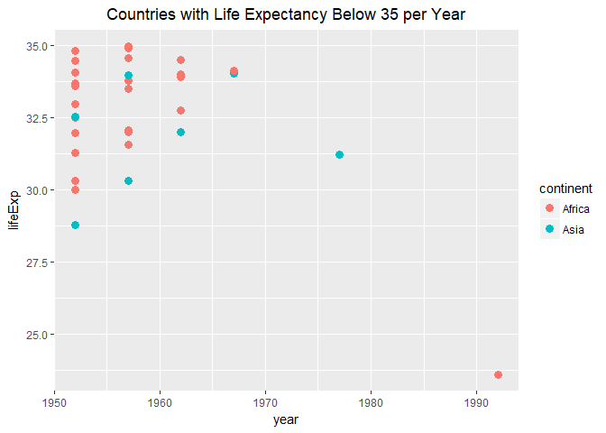
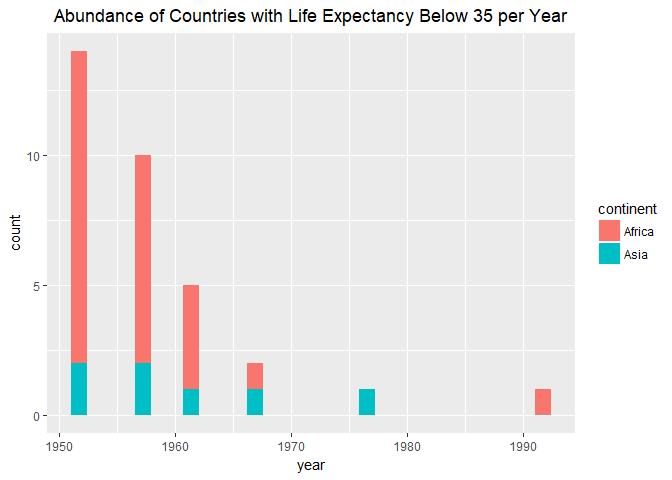

Task 5
================
Nicole Hawe
October 3, 2017

``` r
library(gapminder)
library(tidyverse)
```

    ## Loading tidyverse: ggplot2
    ## Loading tidyverse: tibble
    ## Loading tidyverse: tidyr
    ## Loading tidyverse: readr
    ## Loading tidyverse: purrr
    ## Loading tidyverse: dplyr

    ## Conflicts with tidy packages ----------------------------------------------

    ## filter(): dplyr, stats
    ## lag():    dplyr, stats

``` r
library(knitr)
library(kableExtra)
```

    ## Warning: package 'kableExtra' was built under R version 3.4.2

#### Report countries with low life expectancy over time by continent. Then determine how many countries on each continent have a life expectancy less than this benchmark, for each year.

Okay I found this quite challenging:

``` r
n7 <- gapminder %>%
  filter(lifeExp<35) %>%
  arrange(year) 
kable(head(n7), format="markdown")
```

| country           | continent |  year|  lifeExp|       pop|  gdpPercap|
|:------------------|:----------|-----:|--------:|---------:|----------:|
| Afghanistan       | Asia      |  1952|   28.801|   8425333|   779.4453|
| Angola            | Africa    |  1952|   30.015|   4232095|  3520.6103|
| Burkina Faso      | Africa    |  1952|   31.975|   4469979|   543.2552|
| Djibouti          | Africa    |  1952|   34.812|     63149|  2669.5295|
| Equatorial Guinea | Africa    |  1952|   34.482|    216964|   375.6431|
| Ethiopia          | Africa    |  1952|   34.078|  20860941|   362.1463|

``` r
# I decided to randomly choose a life expectancy lower than 35
```

Then to plot this:

``` r
n7 %>% 
  ggplot(aes(year,lifeExp, group=country,color=continent)) + 
    geom_point(size=3)+
  ggtitle("Countries with Life Expectancy Below 35 per Year")+
  theme(plot.title = element_text(hjust=0.5))
```



``` r
n8 <- gapminder %>%
  filter(lifeExp<35) %>%
  group_by(year) 

n9 <-  summarize(n8, number_countries=length(year))
kable(n9)
```

|  year|  number\_countries|
|-----:|------------------:|
|  1952|                 14|
|  1957|                 10|
|  1962|                  5|
|  1967|                  2|
|  1977|                  1|
|  1992|                  1|

``` r
# Here length is representing the number of countries 
```

``` r
ggplot(n8,aes(year,fill=continent)) +
  geom_histogram()+
  ggtitle("Abundance of Countries with Life Expectancy Below 35 per Year")+
  theme(plot.title = element_text(hjust=0.5))
```

    ## `stat_bin()` using `bins = 30`. Pick better value with `binwidth`.


