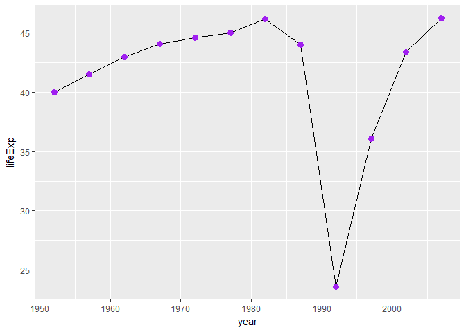

Task 6
================
Nicole Hawe
October 3, 2017

``` r
library(gapminder)
library(tidyverse)
```

    ## Loading tidyverse: ggplot2
    ## Loading tidyverse: tibble
    ## Loading tidyverse: tidyr
    ## Loading tidyverse: readr
    ## Loading tidyverse: purrr
    ## Loading tidyverse: dplyr

    ## Conflicts with tidy packages ----------------------------------------------

    ## filter(): dplyr, stats
    ## lag():    dplyr, stats

``` r
library(knitr)
```

#### Find a Country With an Interesting Story

So for this portion I was curious about life expectancy and why some countries suddenly drop in life expectancy at certain points in time.

I decided to choose Rwnada because I often notice it's drastic plummet in life expectancy:

``` r
filter(gapminder, country == c("Rwanda")) %>%
  select(year, lifeExp) %>%
  ggplot(aes(year, lifeExp)) + geom_line() + geom_point(size =3, colour="purple")
```



You can see this insane drop in LIfe expectancy just before the 90's and after. With some researching it turns out this is during the time of the civil war in this country.

Check out the Wikipedia article [here](https://en.wikipedia.org/wiki/Rwandan_Civil_War)

Below is the data in a table used to generate the figure above:

``` r
filter(gapminder, country == c("Rwanda")) %>%
  select(year, lifeExp) %>%
  kable()
```

|  year|  lifeExp|
|-----:|--------:|
|  1952|   40.000|
|  1957|   41.500|
|  1962|   43.000|
|  1967|   44.100|
|  1972|   44.600|
|  1977|   45.000|
|  1982|   46.218|
|  1987|   44.020|
|  1992|   23.599|
|  1997|   36.087|
|  2002|   43.413|
|  2007|   46.242|
