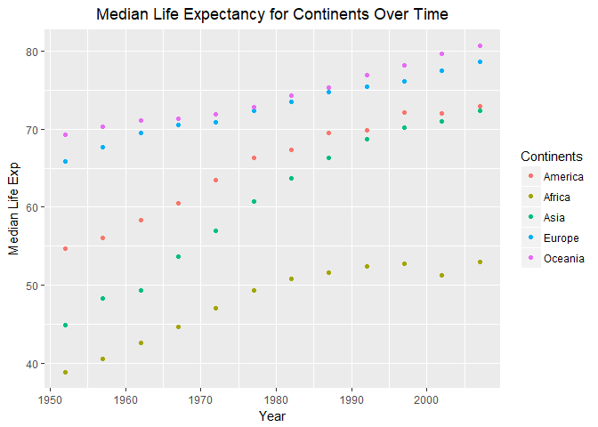
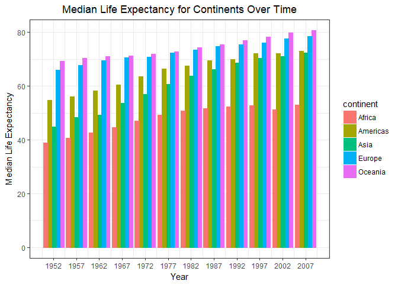

Homework 4 - Reshaping and Joining
================
Nicole Hawe
October 10, 2017

``` r
library(gapminder)
library(tidyverse)
```

    ## Loading tidyverse: ggplot2
    ## Loading tidyverse: tibble
    ## Loading tidyverse: tidyr
    ## Loading tidyverse: readr
    ## Loading tidyverse: purrr
    ## Loading tidyverse: dplyr

    ## Conflicts with tidy packages ----------------------------------------------

    ## filter(): dplyr, stats
    ## lag():    dplyr, stats

``` r
library(knitr)
```

1. Reshape
----------

#### Activity \#3

*Compute the median of life expectancy for all possible combinations of continent and year. Then Reshape that to have one row per year and one variable for each continent. Or the other way around: one row per continent and one variable per year. Use knitr::kable() to make these tables look pretty in your rendered homework. Is there a plot that is easier to make with the data in this shape versis the usual form? If so (or you think so), try it! Reflect.*

``` r
t1 <- gapminder %>% 
  group_by(year, continent) %>% 
  summarize(med_lifeExp = median(lifeExp)) %>% 
  spread(continent, med_lifeExp)
  # I used the spread function here to get my data into the wide format, and have one row per year with one variable for each continent
  kable(t1)
```

|  year|   Africa|  Americas|    Asia|   Europe|  Oceania|
|-----:|--------:|---------:|-------:|--------:|--------:|
|  1952|  38.8330|    54.745|  44.869|  65.9000|  69.2550|
|  1957|  40.5925|    56.074|  48.284|  67.6500|  70.2950|
|  1962|  42.6305|    58.299|  49.325|  69.5250|  71.0850|
|  1967|  44.6985|    60.523|  53.655|  70.6100|  71.3100|
|  1972|  47.0315|    63.441|  56.950|  70.8850|  71.9100|
|  1977|  49.2725|    66.353|  60.765|  72.3350|  72.8550|
|  1982|  50.7560|    67.405|  63.739|  73.4900|  74.2900|
|  1987|  51.6395|    69.498|  66.295|  74.8150|  75.3200|
|  1992|  52.4290|    69.862|  68.690|  75.4510|  76.9450|
|  1997|  52.7590|    72.146|  70.265|  76.1160|  78.1900|
|  2002|  51.2355|    72.047|  71.028|  77.5365|  79.7400|
|  2007|  52.9265|    72.899|  72.396|  78.6085|  80.7195|

Now my data is in the wide format, I tried to create a plot but had a lot of trouble. With some research I came to the conclusion that although wide format may be easier to view in a table, the long format is the best for plotting. In this wide format you would have to essentialy plot each continent as a 'y' value. This is what I have done below:

``` r
cols <- c( "c1" = "red", "c2" = "blue", "c3"="purple", "c4"="green", "c5"="yellow")
#this was to just establish my colors off the bat, to save a lot of writing
```

``` r
p1 <- t1 %>% 
  ggplot(aes(x=year))+
  geom_point(aes(y=Americas, color="c1"))+
  geom_point(aes(y=Africa, color="c2"))+
  geom_point(aes(y=Asia, color="c3"))+
  geom_point(aes(y=Europe, colour= "c4"))+
  geom_point(aes(y=Oceania, color="c5"))+
  xlab(label="Year")+
  ylab(label="Median Life Exp")+
  scale_colour_discrete("Continents", labels=c("America", "Africa", "Asia", "Europe", "Oceania"))+
  labs(title="Median Life Expectancy for Continents Over Time")+
  theme(plot.title = element_text(hjust=0.5))
  
p1
```



This is extremely tedious and in my opinion not the best format of data to graph. Does anyone know if there is another graphing command to deal with wide data?

So now let me put this data in the long format and attempt graphing:

``` r
  t2 <- gapminder %>%
  group_by(year,continent) %>%
  summarize(medLifeExp = median(lifeExp)) %>%
  spread(continent,medLifeExp) %>%
  gather(continent,median_LifeExp,-c(year)) 
  head(t2) %>%
    #I used head to only show a portion of this quite long table
  kable()
```

|  year| continent |  median\_LifeExp|
|-----:|:----------|----------------:|
|  1952| Africa    |          38.8330|
|  1957| Africa    |          40.5925|
|  1962| Africa    |          42.6305|
|  1967| Africa    |          44.6985|
|  1972| Africa    |          47.0315|
|  1977| Africa    |          49.2725|

So above I transformed data into wide using spread and then back to long using gather. Now I can plot thins long data:

``` r
p2 <- t2 %>%
  ggplot(aes(year,median_LifeExp)) +
  geom_bar(aes(color=continent,fill=continent),stat="identity", position="dodge") +
  labs(title="Median Life Expectancy for Continents Over Time") +
  scale_y_continuous("Median Life Expectancy") +
  scale_x_continuous("Year",breaks=c(1952,1957,1962,1967,1972,1977,1982,1987,1992,1997,2002,2007)) +
  # these breaks are at every year that contains recorded data in the gapminder dataset which I thought better showed the data.
  
  theme_bw() +
  theme(axis.text.x = element_text(angle=0),
          plot.title = element_text(hjust=0.5))
p2
```



I wanted the continents to be side by side for each year, and found that using position="dodge" with help from this [link](http://ggplot2.tidyverse.org/reference/position_dodge.html)

2. Join
-------

#### Activity \#1

I found this [cheatsheet](http://stat545.com/bit001_dplyr-cheatsheet.html)very helpful for this portion of the assignment.

*Create a second data frame, complementary to Gapminder. Join this with (part of) Gapminder using a dplyr join function and make some observations about the process and result. Explore the different types of joins. Examples of a second data frame you could build: One row per country, a country variable and one or more variables with extra info, such as language spoken, NATO membership, national animal, or capitol city. If you really want to be helpful, you could attempt to make a pull request to resolve this issue, where I would like to bring ISO country codes into the gapminder package. One row per continent, a continent variable and one or more variables with extra info, such as northern versus southern hemisphere.*

I'll begin by creating my first smaller dataset by filtering for data after the year 2000.

``` r
ds1 <- gapminder %>%
  group_by(continent) %>%
  filter(year>2000) %>%
  summarize(LifeExp = mean(lifeExp),Population=mean(pop),GdpPercap=mean(gdpPercap)) 

kable(ds1)
```

| continent |   LifeExp|  Population|  GdpPercap|
|:----------|---------:|-----------:|----------:|
| Africa    |  54.06563|    16954458|   2844.209|
| Americas  |  73.01508|    34972879|  10145.354|
| Asia      |  69.98118|   112329637|  11323.559|
| Europe    |  77.17460|    19405373|  23383.107|
| Oceania   |  80.22975|    12001194|  28374.483|

Now I'll create a second smaller dataset with the continents and I'll add the coastline in kilometers and the highest point in meters of each continent. This data is courtesy of this [site](https://www.sporcle.com/games/quizace/order-the-continents-ii/results)

``` r
continent <- c("Africa","Americas","Asia","Europe","Oceania", "Antarctica")
Coastline_kms <- c(30500, 328000, 230300, 32000, 71200, 18000)
Highest_point_m <- c(5895, 6960, 8850, 5642, 3754, 4892)
ds2 <- data.frame(continent,Coastline_kms, Highest_point_m)


kable(ds2)
```

| continent  |  Coastline\_kms|  Highest\_point\_m|
|:-----------|---------------:|------------------:|
| Africa     |           30500|               5895|
| Americas   |          328000|               6960|
| Asia       |          230300|               8850|
| Europe     |           32000|               5642|
| Oceania    |           71200|               3754|
| Antarctica |           18000|               4892|

### Now it's time to perform some joins on these two new datasets

I want to keep in mind the two types of joins in dyplyr:

1.  Mutating joins

left or right\_join: join by matching rows inner\_join: joins data, retaining only rows from both data sets full\_join: joins data, retaining all values and rows

1.  Filtering joins

semi\_join: joins all rows from one data set that have a match in a second data set anti\_join: joins all rows from one data set that do not have a match in a second data set

#### Mutating Joins

##### - Left\_Join

``` r
left_join(ds1, ds2, by ="continent") %>% 
  kable()
```

    ## Warning: Column `continent` joining factors with different levels, coercing
    ## to character vector

| continent    |      LifeExp|    Population|     GdpPercap|  Coastline\_kms|  Highest\_point\_m|
|:-------------|------------:|-------------:|-------------:|---------------:|------------------:|
| Africa       |     54.06563|      16954458|      2844.209|           30500|               5895|
| Americas     |     73.01508|      34972879|     10145.354|          328000|               6960|
| Asia         |     69.98118|     112329637|     11323.559|          230300|               8850|
| Europe       |     77.17460|      19405373|     23383.107|           32000|               5642|
| Oceania      |     80.22975|      12001194|     28374.483|           71200|               3754|
| What would i |  t look like|  if we switch|  ed the datse|        t order?|                   |

``` r
left_join(ds2, ds1, by = "continent") %>% 
  kable()
```

    ## Warning: Column `continent` joining factors with different levels, coercing
    ## to character vector

| continent  |  Coastline\_kms|  Highest\_point\_m|   LifeExp|  Population|  GdpPercap|
|:-----------|---------------:|------------------:|---------:|-----------:|----------:|
| Africa     |           30500|               5895|  54.06563|    16954458|   2844.209|
| Americas   |          328000|               6960|  73.01508|    34972879|  10145.354|
| Asia       |          230300|               8850|  69.98118|   112329637|  11323.559|
| Europe     |           32000|               5642|  77.17460|    19405373|  23383.107|
| Oceania    |           71200|               3754|  80.22975|    12001194|  28374.483|
| Antarctica |           18000|               4892|        NA|          NA|         NA|

> You can see here that when you left join with ds1 first it leaves out Antarctica whereas with ds2 first it includes Antartica but provide NA for values not present in ds1!

##### - Inner\_Join

``` r
inner_join(ds1, ds2) %>% 
kable()
```

    ## Joining, by = "continent"

    ## Warning: Column `continent` joining factors with different levels, coercing
    ## to character vector

| continent |   LifeExp|  Population|  GdpPercap|  Coastline\_kms|  Highest\_point\_m|
|:----------|---------:|-----------:|----------:|---------------:|------------------:|
| Africa    |  54.06563|    16954458|   2844.209|           30500|               5895|
| Americas  |  73.01508|    34972879|  10145.354|          328000|               6960|
| Asia      |  69.98118|   112329637|  11323.559|          230300|               8850|
| Europe    |  77.17460|    19405373|  23383.107|           32000|               5642|
| Oceania   |  80.22975|    12001194|  28374.483|           71200|               3754|

``` r
# Note that inner_join matched by the common column which was continent!
```

With this join function the order of "x" and "y" or in my case "ds1" and "ds2", does not matter because u=you will always eliminate rows not found in both sets. As you can see below:

``` r
inner_join(ds2, ds1) %>% 
kable()
```

    ## Joining, by = "continent"

    ## Warning: Column `continent` joining factors with different levels, coercing
    ## to character vector

| continent |  Coastline\_kms|  Highest\_point\_m|   LifeExp|  Population|  GdpPercap|
|:----------|---------------:|------------------:|---------:|-----------:|----------:|
| Africa    |           30500|               5895|  54.06563|    16954458|   2844.209|
| Americas  |          328000|               6960|  73.01508|    34972879|  10145.354|
| Asia      |          230300|               8850|  69.98118|   112329637|  11323.559|
| Europe    |           32000|               5642|  77.17460|    19405373|  23383.107|
| Oceania   |           71200|               3754|  80.22975|    12001194|  28374.483|

##### - Full\_Join

``` r
full_join(ds1, ds2) %>% 
kable()
```

    ## Joining, by = "continent"

    ## Warning: Column `continent` joining factors with different levels, coercing
    ## to character vector

| continent        |      LifeExp|     Population|    GdpPercap|   Coastline\_kms|  Highest\_point\_m|
|:-----------------|------------:|--------------:|------------:|----------------:|------------------:|
| Africa           |     54.06563|       16954458|     2844.209|            30500|               5895|
| Americas         |     73.01508|       34972879|    10145.354|           328000|               6960|
| Asia             |     69.98118|      112329637|    11323.559|           230300|               8850|
| Europe           |     77.17460|       19405373|    23383.107|            32000|               5642|
| Oceania          |     80.22975|       12001194|    28374.483|            71200|               3754|
| Antarctica       |           NA|             NA|           NA|            18000|               4892|
| &gt; You can see |  the full\_j|  oin keeps all|  rows from d|  s1 and all rows|          from ds2!|

#### Filtering Joins

##### - Semi\_Join

``` r
semi_join(ds1, ds2, by = "continent") %>% 
  kable()
```

    ## Warning: Column `continent` joining factors with different levels, coercing
    ## to character vector

| continent |   LifeExp|  Population|  GdpPercap|
|:----------|---------:|-----------:|----------:|
| Africa    |  54.06563|    16954458|   2844.209|
| Americas  |  73.01508|    34972879|  10145.354|
| Asia      |  69.98118|   112329637|  11323.559|
| Europe    |  77.17460|    19405373|  23383.107|
| Oceania   |  80.22975|    12001194|  28374.483|

> You can see that all rows in ds1 that have a match in ds2 are shown. But additional information in ds2 is filtered out because it does not have a match in ds1, for example Antartica is not present in ds1

But if we reverse the order:

``` r
semi_join(ds2, ds1) %>% 
  kable()
```

    ## Joining, by = "continent"

    ## Warning: Column `continent` joining factors with different levels, coercing
    ## to character vector

| continent |  Coastline\_kms|  Highest\_point\_m|
|:----------|---------------:|------------------:|
| Africa    |           30500|               5895|
| Americas  |          328000|               6960|
| Asia      |          230300|               8850|
| Europe    |           32000|               5642|
| Oceania   |           71200|               3754|

> This order now shows the columns of ds2 but for the continents present in both ds1 and ds2!

##### - Anti\_Join

``` r
anti_join(ds2, ds1, by = "continent") %>% 
  knitr::kable(format = "markdown")
```

    ## Warning: Column `continent` joining factors with different levels, coercing
    ## to character vector

| continent  |  Coastline\_kms|  Highest\_point\_m|
|:-----------|---------------:|------------------:|
| Antarctica |           18000|               4892|

nt join gives the columns of x for rows that are NOT in y. Because all of the rows in the old dataset are also in the new dataset, there are no results for the call anti\_join(old,new)
