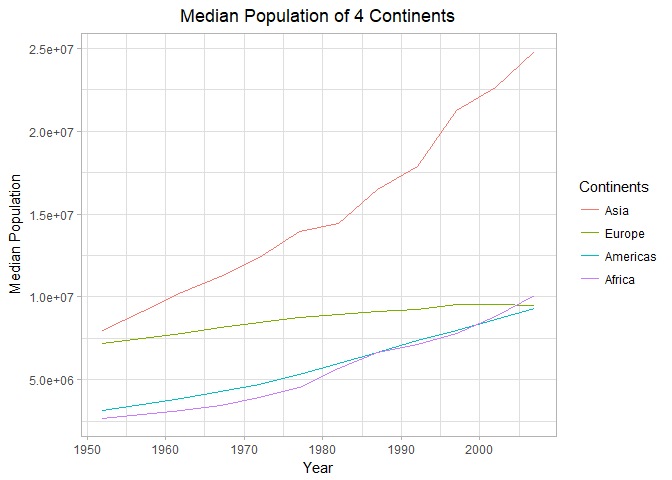

Factor and Figure Management
================
Nicole Hawe
October 19, 2017

### Homework Assignment 5

------------------------------------------------------------------------

#### Factor Management

I decided to stick with trusty Gapminder for this assignment!

I will begin by loading the packages:

``` r
suppressPackageStartupMessages(library(gapminder))
suppressPackageStartupMessages(library(tidyverse))
suppressPackageStartupMessages(library(knitr))
suppressPackageStartupMessages(library(forcats))
```

    ## Warning: package 'forcats' was built under R version 3.4.2

------------------------------------------------------------------------

-   Drop Oceania:

Prior to starting this take I just want to quickly take a look at gapminder:

``` r
str(gapminder)
```

    ## Classes 'tbl_df', 'tbl' and 'data.frame':    1704 obs. of  6 variables:
    ##  $ country  : Factor w/ 142 levels "Afghanistan",..: 1 1 1 1 1 1 1 1 1 1 ...
    ##  $ continent: Factor w/ 5 levels "Africa","Americas",..: 3 3 3 3 3 3 3 3 3 3 ...
    ##  $ year     : int  1952 1957 1962 1967 1972 1977 1982 1987 1992 1997 ...
    ##  $ lifeExp  : num  28.8 30.3 32 34 36.1 ...
    ##  $ pop      : int  8425333 9240934 10267083 11537966 13079460 14880372 12881816 13867957 16317921 22227415 ...
    ##  $ gdpPercap: num  779 821 853 836 740 ...

> here we see that the factor continent has 5 levels

Now if I try to drop Oceania by simply filtering it out I get:

``` r
no_oceania <- gapminder %>% 
  filter(continent != "Oceania")
# I have filtered OCeania out and now want to look at the structure
str(no_oceania)
```

    ## Classes 'tbl_df', 'tbl' and 'data.frame':    1680 obs. of  6 variables:
    ##  $ country  : Factor w/ 142 levels "Afghanistan",..: 1 1 1 1 1 1 1 1 1 1 ...
    ##  $ continent: Factor w/ 5 levels "Africa","Americas",..: 3 3 3 3 3 3 3 3 3 3 ...
    ##  $ year     : int  1952 1957 1962 1967 1972 1977 1982 1987 1992 1997 ...
    ##  $ lifeExp  : num  28.8 30.3 32 34 36.1 ...
    ##  $ pop      : int  8425333 9240934 10267083 11537966 13079460 14880372 12881816 13867957 16317921 22227415 ...
    ##  $ gdpPercap: num  779 821 853 836 740 ...

> You see that although there are fewer observations, the factor Continent still has 5 levels!

I can check this out more using factor count looking at the original gapminder versus no\_oceania:

``` r
fct_count(gapminder$continent)
```

    ## # A tibble: 5 x 2
    ##          f     n
    ##     <fctr> <int>
    ## 1   Africa   624
    ## 2 Americas   300
    ## 3     Asia   396
    ## 4   Europe   360
    ## 5  Oceania    24

``` r
fct_count(no_oceania$continent)
```

    ## # A tibble: 5 x 2
    ##          f     n
    ##     <fctr> <int>
    ## 1   Africa   624
    ## 2 Americas   300
    ## 3     Asia   396
    ## 4   Europe   360
    ## 5  Oceania     0

> In the original gapminder Oceania has 24 counts whereas in no\_oceania where I have filtered out Oceania it is still present as a level but countains no counts

There are actually 2 ways to fix this problem I can use the forcats drop levels function to drop Oceania for good:

``` r
no_oceania2 <- no_oceania$continent %>% 
  fct_drop() %>% 
  levels()
# Now we can check it out with factor count
fct_count(no_oceania2)
```

    ## # A tibble: 4 x 2
    ##          f     n
    ##     <fctr> <int>
    ## 1   Africa     1
    ## 2 Americas     1
    ## 3     Asia     1
    ## 4   Europe     1

``` r
str(no_oceania2)
```

    ##  chr [1:4] "Africa" "Americas" "Asia" "Europe"

Or I can use the base function droplevels():

``` r
no_oceania3 <- no_oceania %>% 
  droplevels()
fct_count(no_oceania3$continent)
```

    ## # A tibble: 4 x 2
    ##          f     n
    ##     <fctr> <int>
    ## 1   Africa   624
    ## 2 Americas   300
    ## 3     Asia   396
    ## 4   Europe   360

``` r
str(no_oceania3)
```

    ## Classes 'tbl_df', 'tbl' and 'data.frame':    1680 obs. of  6 variables:
    ##  $ country  : Factor w/ 140 levels "Afghanistan",..: 1 1 1 1 1 1 1 1 1 1 ...
    ##  $ continent: Factor w/ 4 levels "Africa","Americas",..: 3 3 3 3 3 3 3 3 3 3 ...
    ##  $ year     : int  1952 1957 1962 1967 1972 1977 1982 1987 1992 1997 ...
    ##  $ lifeExp  : num  28.8 30.3 32 34 36.1 ...
    ##  $ pop      : int  8425333 9240934 10267083 11537966 13079460 14880372 12881816 13867957 16317921 22227415 ...
    ##  $ gdpPercap: num  779 821 853 836 740 ...

> You can see in both cases the level for Oceania is dropped as continent only has 4 levels. However when using the forcats::fct\_drop you lose all the other information in the data frame. I believe this is because with this forcats function you have to specify the factor you are looking at ie continents, and this then eliminates all other information. With the base function drop levels I looks through the entire dataframe and factors to drop levels, maintaining the information.

------------------------------------------------------------------------

-   Reorder the Continents:

To do this I am going to work from my new no\_oceania3 dataframe with no Oceania.

My plan is to check out the current order of the continents column and reorder the factor levels based on: frequency of continents column and then based on the quantitative variable LifeExp.

``` r
no_oceania3$continent %>% 
  levels()
```

    ## [1] "Africa"   "Americas" "Asia"     "Europe"

> The current order seems to be alphabetical

Now I will change the order based on frequency:

``` r
no_oceania3$continent %>% 
  fct_infreq() %>% 
  levels()
```

    ## [1] "Africa"   "Asia"     "Europe"   "Americas"

Now Let me try to change the order based on lowest Life expectancy first:

``` r
no_oceania3$continent %>% 
  fct_reorder(no_oceania3$lifeExp, min) %>% 
  levels()
```

    ## [1] "Africa"   "Asia"     "Americas" "Europe"

Now if I wanted to flip this order so that the continent with the highest is first:

``` r
no_oceania3$continent %>% 
  fct_reorder(no_oceania3$lifeExp, min, .desc = TRUE) %>% 
  levels()
```

    ## [1] "Europe"   "Americas" "Asia"     "Africa"

------------------------------------------------------------------------

-   Practice Writing and Reading Files:

``` r
write_csv(no_oceania3, "~/practice-file")
no_oceania3_read <- read_csv("~/practice-file")
```

    ## Parsed with column specification:
    ## cols(
    ##   country = col_character(),
    ##   continent = col_character(),
    ##   year = col_integer(),
    ##   lifeExp = col_double(),
    ##   pop = col_integer(),
    ##   gdpPercap = col_double()
    ## )

For the above sections I used the [factor class note](http://stat545.com/block029_factors.html) as well as the [writing and reading notes](http://stat545.com/block026_file-out-in.html)

------------------------------------------------------------------------

-   More Exploration: characterizing data before changing of levels

``` r
no_oceania3 %>% 
  group_by(continent, year) %>% 
  summarize(med_pop = median(pop)) %>% 
  head() %>% 
  kable
```

| continent |  year|  med\_pop|
|:----------|-----:|---------:|
| Africa    |  1952|   2668125|
| Africa    |  1957|   2885791|
| Africa    |  1962|   3145210|
| Africa    |  1967|   3473693|
| Africa    |  1972|   3945595|
| Africa    |  1977|   4522666|

> Here you can see it is ordered alphabetically

NOw I'll graph this based on alphabetical order:

``` r
no_oceania3 %>% 
  group_by(continent, year) %>% 
  summarize(med_pop = median(pop)) %>% 
  ggplot(aes(x = year, y = med_pop)) +
  geom_line(aes(colour = continent))
```


Now I can re order this using the arrange function, which changes the dataframe and orders in descending order:

``` r
no_oceania4 <- no_oceania3 %>% 
  group_by(continent, year) %>% 
  summarize(med_pop = median(pop)) %>% 
  arrange(desc(med_pop)) 
  

head(no_oceania4)
```

    ## # A tibble: 6 x 3
    ## # Groups:   continent [1]
    ##   continent  year  med_pop
    ##      <fctr> <int>    <dbl>
    ## 1      Asia  2007 24821286
    ## 2      Asia  2002 22662365
    ## 3      Asia  1997 21229759
    ## 4      Asia  1992 17861905
    ## 5      Asia  1987 16495304
    ## 6      Asia  1982 14441916

> You can see that the order has now changes in the table

But when we go to graph it:

``` r
no_oceania3 %>% 
  group_by(continent, year) %>% 
  summarize(med_pop = median(pop)) %>% 
  arrange(desc(med_pop))%>% 
  ggplot(aes(x = year, y = med_pop)) +
  geom_line(aes(colour = continent))
```


It remains in the same alphabetical order in the legend! But what if I try reordering based on highest med pop to lowest using fact\_reorder2. I use fct\_reorder2 because this is quatitative versus quatitative data:

``` r
no_oceania3 %>% 
  group_by(continent, year) %>% 
  summarize(med_pop = median(pop)) %>% 
  arrange(desc(med_pop))%>% 
  ggplot(aes(x = year, y = med_pop, colour = fct_reorder2(continent, year==1972, med_pop)))+
  geom_line() +
  scale_colour_discrete(name = "Continents") +
  labs(title = "Median Population of 4 Continents", x = "Year", y = "Median Population")+
  theme_light()+
  theme(plot.title = element_text(hjust=0.5))
```



> There now the legend shows Asia first with the clear highest, however the next 3 interchange positions over the course of the years sampled, but I set the year to be 1972 to show that order.

------------------------------------------------------------------------

-   I can also read and write files by using TSV

``` r
write_tsv(no_oceania4, "~/practice-write-file")
no_oceania4_read <- read_tsv("~/practice-write-file")
```

    ## Parsed with column specification:
    ## cols(
    ##   continent = col_character(),
    ##   year = col_integer(),
    ##   med_pop = col_double()
    ## )

``` r
head(no_oceania4_read)
```

    ## # A tibble: 6 x 3
    ##   continent  year  med_pop
    ##       <chr> <int>    <dbl>
    ## 1      Asia  2007 24821286
    ## 2      Asia  2002 22662365
    ## 3      Asia  1997 21229759
    ## 4      Asia  1992 17861905
    ## 5      Asia  1987 16495304
    ## 6      Asia  1982 14441916

``` r
tail(no_oceania4_read)
```

    ## # A tibble: 6 x 3
    ##   continent  year med_pop
    ##       <chr> <int>   <dbl>
    ## 1  Americas  1957 3507701
    ## 2    Africa  1967 3473693
    ## 3  Americas  1952 3146381
    ## 4    Africa  1962 3145210
    ## 5    Africa  1957 2885791
    ## 6    Africa  1952 2668125

> You can see that through writing and reading this re ordering by descending median population was kept!

------------------------------------------------------------------------

#### Data Visualization

*Remake at least one figure or create a new one, in light of something you learned in the recent class meetings about visualization design and color. Maybe juxtapose your first attempt and what you obtained after some time spent working on it. Reflect on the differences. If using Gapminder, you can use the country or continent color scheme that ships with Gapminder*

FOr this exercise I will use a plot of Life expectancy versus GDP per Capita. Now in the beginning when I was newly introduced to ggplot, I would be able to produce a figure like this:

``` r
no_oceania3 %>%
  filter(country %in% c("Cambodia", "Iran", "Israel", "Singapore")) %>% 
  ggplot(aes(x = gdpPercap, y = lifeExp))+
  geom_point() 
```


Simple yet still contains necessary information.

Now I will spice up my figure with everything I have learnt throughout STAT 545!

First I'm going to load brewer colours:

``` r
suppressPackageStartupMessages(library(RColorBrewer))
```

``` r
plot <- no_oceania3 %>%
  filter(country %in% c("Cambodia", "Iran", "Israel", "Singapore","Albania", "Sweden", "Germany", "Italy")) %>%   ggplot(aes(x = gdpPercap, y = lifeExp))+
  geom_point(aes(size = pop), pch=21, alpha=0.7)+ 
  scale_size_continuous(range = c(2, 24)) +
  scale_y_log10()+
  facet_wrap(~ continent) +
  ylim(c(20,100)) +
  aes(fill = country) +
   scale_fill_brewer(palette="Set1")+
  labs(title = "GDP per Capita  vs Life Expectancy\n With Population Dependent Representation for Countries in Asia and Europe", x = "GDP per capita", y = "Life Expectancy") +
   theme(plot.title = element_text(hjust=0.5))
```

    ## Scale for 'y' is already present. Adding another scale for 'y', which
    ## will replace the existing scale.

``` r
plot+guides(size=FALSE)
```


#### Writing Figures to Files Using ggsave

``` r
ggsave("gdp-lifeexp-asia-europe.png")
```

    ## Saving 7 x 5 in image

Here is the figure embedded:


For this sections of the assigment I relied on these [visualization notes](http://stat545.com/cm013-notes_and_exercises.html)

Now back to my README with [*REFLECTIONS*](https://github.com/nicolehawe/STAT545-HW-Hawe-Nicole/blob/master/HW05/README.md)
